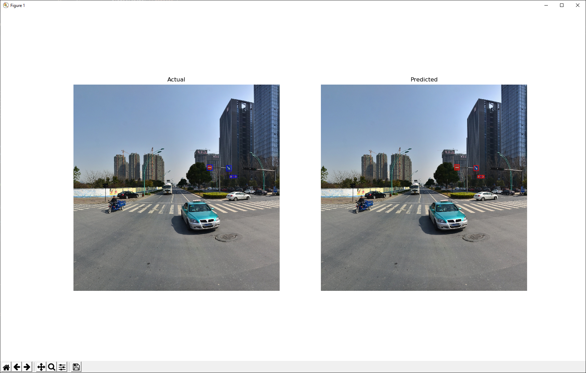

## Overview

This project is intended to solve the traffic sign detection/classification challenge hosted at https://www.crowdanalytix.com/contests/traffic-sign-detection-and-classification and is based on a tutorial found in this book: https://machinelearningmastery.com/deep-learning-for-computer-vision/

Model weights were downloaded/initialized from: https://goo.gl/a2p7dS

## Installation

This project uses the keras MaskRCNN Implementation found here: https://github.com/matterport/Mask_RCNN. Follow the setup instructions here: https://github.com/matterport/Mask_RCNN#installation. Note the optional step is not required to run this repository. Following the install instructions from that repository will install most of the requirments to run this project; finish setup by installing the requirements found at the root of this repository.
Note that this project also uses WandB (similar to tensorboard) for basic analytics during training but is not required.

This project uses the training file (CAX_Train_AnnotationFile.csv) found at the above listed contest site. It is renamed to `train.csv` here and should be located in this directory. Additionally, a single directory named `train` with the training images should be located in the root of this repository. Similarly, the test dataset

## Training

Training is run by running either `python train.py` or `wandb run python train.py` (if wandb is installed). This expects training images to be in the `/train` folder in the current directory and the training file to be in the current directory named `train.csv`.

## Evaluation

You can evaluate the mAP of the training set by running `python evaluate.py`. You'll need to supply a model path and filename using the `-m` switch as well as the image directory (`-d` switch) and training csv (`c` switch) if they are different (`./train` and `train.csv`, respectively).

You can evaluate individual **training** images for ground truth vs. predictions using `python predict.py`. Defaults are the same as as above, but you'll need to specify an image file name with the `-i` switch. The path is assumed from the `--imagedir` switch already (default of `./train`).

Sample:

## Predicting new data

You can run predictions on new data by running `python predict_test_data_batch.py`. Configuration options are the same as for evaluation, except you need to provide both a test and train CSV files to build the datasets. The training CSV file is only to build the class names from (in a future release, this will be built in).

A single image can be plotted for demonstration purposes along with its predicted class by using `python predict_new.py`. The `-i` switch will allow you to pass in an arbitrary image; the model path, image dir, and train csv (for generating class labels) are required as described above.

Sample:

